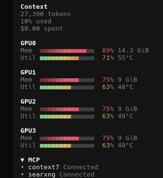

# gpu-sidebar

Live GPU utilization and memory bars in the OpenCode sidebar, styled like
btop's meters. One block per GPU — however many the machine actually has:

```
GPU0
Mem   ■■■■■■■■■■■■  90% 10.9 GiB   ← fraction of total VRAM in use
Util  ■■■■■■■■■■■■  72% 28°C      ← 0-100% of GPU compute, plus temperature
```


The temperature readout is colored on a blue→red gradient (blue at 30°C
and below, red at 85°C and above).

**NVIDIA only** — stats are read via `nvidia-smi`. If the box has no
nvidia-smi, the panel says so plainly instead of crashing.

## Install (the 30-second version)

> ⚠️ **Gotcha #1: this goes in `tui.json`, NOT `opencode.json`.**
>
> OpenCode has two plugin systems. The official plugin docs cover only the
> server-side one (`opencode.json`); sidebar panels are **TUI plugins**,
> configured in a separate file: `~/.config/opencode/tui.json`. The two
> look similar, but a TUI plugin listed in `opencode.json` will silently
> do nothing.

Add one line to the `"plugin"` list in `~/.config/opencode/tui.json`
(create the file if you don't have one — it takes the same shape), then
restart OpenCode. The two modes, side by side:

```jsonc
// Same machine as the GPU (default):
["gpu-sidebar"]

// Remote GPU host — fill in the GPU host's LAN address:
["gpu-sidebar", { "url": "http://192.168.x.x:9100" }]
```

That's it. No address is baked into the package on purpose, so the repo
stays shareable.

## Embedded mode (default)

No `url` option → the plugin reads the local machine's GPUs directly via
`nvidia-smi`, in-process. This is the common case: you run OpenCode on
the same box as your GPU(s), and there's nothing else to set up.

If no NVIDIA GPU is found, the panel shows a one-line hint pointing you
at remote mode instead of a blank or error screen.

## Remote mode

When the GPU(s) live on another machine (a server, a home lab box, …):

1. On the GPU host, run the bundled reporter — no Python needed:

   ```sh
   npx gpu-sidebar-reporter --port 9100
   ```

   (Or `npm i -g gpu-sidebar`, then `gpu-sidebar-reporter`.) The reporter
   ships pre-compiled to plain JS (`dist/reporter.js`), so any reasonably
   modern Node on the GPU host is enough to run it — no TypeScript runtime
   support required. It serves one JSON payload per `GET /` with one entry
   per GPU detected. `--help` prints usage **plus the exact `tui.json`
   line to add**, with the machine's LAN address filled in for you.

2. On the machine running OpenCode, use the remote form above, with the
   GPU host's address.

3. To keep the reporter alive across reboots, a ready-to-edit systemd unit
   ships with the package: `gpu-sidebar-reporter.service.example` (adjust
   the user and paths, install as `gpu-metrics.service`, then
   `systemctl enable --now gpu-metrics`).

The URL can also come from the `GPU_METRICS_URL` environment variable
instead of the `tui.json` option, if you prefer.

## What it shows

Each GPU is a small block: its label, then one line per metric — a bar,
a percent, and (for memory) a value readout in GiB. The bars reproduce
btop's meter design byte-for-byte (same block character, same
positional gradient colors, same fill rule) — the gradient table is even
pinned in the unit tests to the exact RGB values a live btop 1.4.6
session emitted.

The panel renders one block per GPU in whatever payload arrives — 1 GPU
shows 1 block, 8 GPUs show 8. For normal fleet sizes it stays
content-sized (takes only the lines it needs, so the other sidebar
elements keep their space); only past a configurable threshold
(`scrollAfterGpus` in the visual config, default 10 GPUs) does it switch
to a scroll area, so an absurd fleet scrolls instead of overflowing the
sidebar.

## Tuning the look

Every visual choice — bar width, block characters, colors, labels, bar
order, refresh rate — lives in one labeled block:
[`src/visual-config.ts`](src/visual-config.ts). Change it there, nowhere
else.

## Data contract

The reporter's response for `GET /` always has this exact shape — field
names and types are part of the contract; the TUI plugin depends on them:

```json
{
  "timestamp": "2026-08-30T00:12:34Z",
  "gpus": [
    {
      "index": 0,
      "name": "Tesla P100",
      "utilization_percent": 42,
      "memory_used_mib": 9588,
      "memory_total_mib": 16384,
      "temperature_c": 58
    }
  ]
}
```

| Field | Type | Meaning |
|-------|------|---------|
| `timestamp` | string | ISO 8601 UTC, time the stats were sampled |
| `gpus` | array | One entry per physical GPU, in `nvidia-smi` index order (however many are installed — not hardcoded) |
| `gpus[].index` | int | GPU number, as reported by `nvidia-smi` |
| `gpus[].name` | string | GPU model name |
| `gpus[].utilization_percent` | int or null | GPU utilization, 0–100; `null` if the driver can't report it |
| `gpus[].memory_used_mib` | int or null | VRAM used, in MiB |
| `gpus[].memory_total_mib` | int or null | Total VRAM, in MiB |
| `gpus[].temperature_c` | int or null | GPU core temperature, in Celsius; `null` if the driver can't report it |

If `nvidia-smi` fails at request time, the reporter responds `500` with
`{"error": "..."}` rather than guessing.

## Development

Requires Node 23.6+ and Bun to develop from source: the reporter, preview
and tests run as plain TypeScript directly from `src/` (Node type
stripping, no build needed for local dev). For publishing, both entry
points get compiled ahead of time — the TUI entry to `dist/tui.js`
(bundled by Bun) and the reporter to `dist/reporter.js` (plain `tsc`,
since Node refuses to type-strip anything under `node_modules`, which is
where an installed package's files live) — both rebuilt automatically on
publish.

```sh
bun install              # or npm install
npm test                 # unit tests: btop color vectors, parser, scaling, reporter
npm run typecheck
npm run build            # build dist/tui.js and dist/reporter.js (needs Bun)
node src/preview.ts      # terminal preview — same rows as the panel
node src/preview.ts --sample --once   # built-in fake data, no GPU needed
node src/preview.ts --url http://host:9100
node src/reporter.ts --selftest --once
```

The rendering is a **pure function** (endpoint JSON in, display rows out)
in `src/gpu-bar.ts`; the preview and the TUI panel both call it, so they
can't drift apart. The `nvidia-smi` shell-out lives in exactly one place
(`src/collect.ts`), shared by the plugin's embedded mode and the
reporter.

## Limitations

- NVIDIA only (nvidia-smi). Other GPU vendors are not attempted.
- The sidebar panel is a TUI plugin: it needs OpenCode's TUI (the
  terminal interface), not just the CLI.
